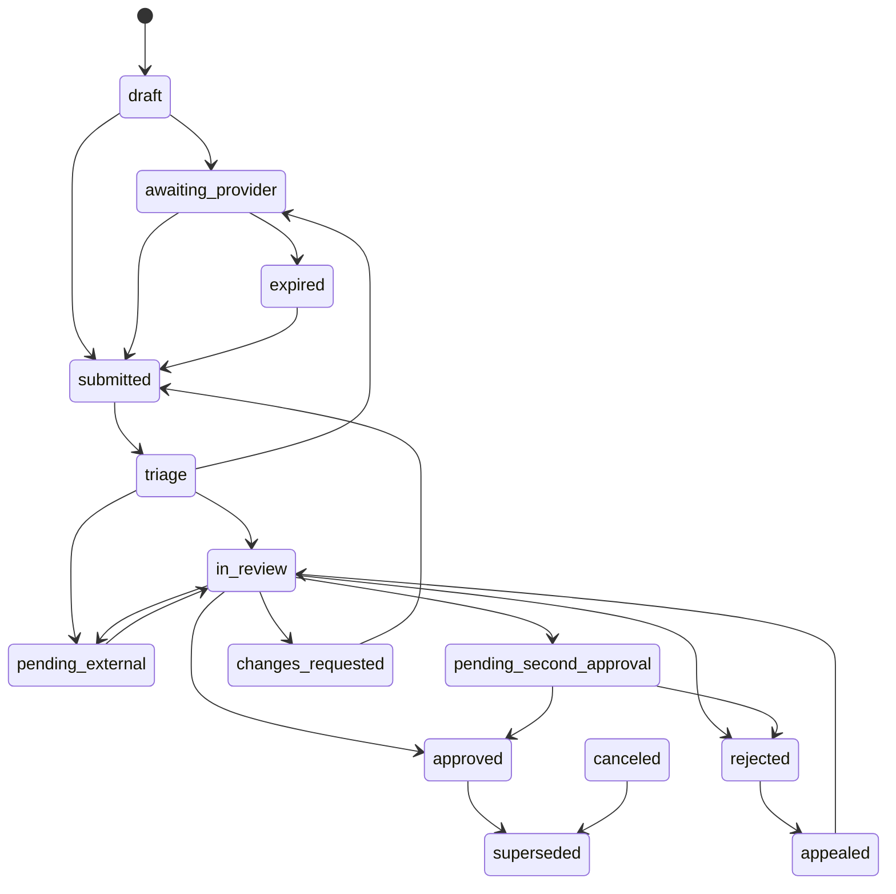
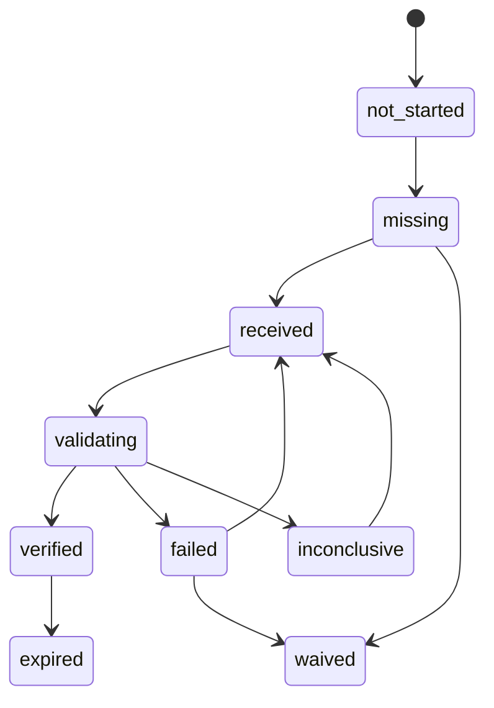

# FASTT — Contrato operativo de Fase 0 del Centro de Mando

**Versión:** 1.0  
**Fecha de decisión:** 2026-09-02  
**Estado:** aprobado internamente para diseño, desarrollo y piloto controlado  
**Responsable actual:** responsable único de FASTT  
**Alcance:** Bolivia, hospedaje, cohorte inicial por invitación  
**Fuente ejecutiva relacionada:** `docs/reports/report-source.md`

> Este documento es la fuente canónica de decisiones de la Fase 0 del Centro de Mando. Convierte el análisis estratégico en reglas operativas, de datos, acceso, riesgo y arquitectura. No sustituye asesoría jurídica, fiscal, regulatoria o de seguridad especializada.

---

## 1. Decisión ejecutiva y autoridad del documento

FASTT construirá el Centro de Mando como un sistema de **casos, requisitos, evidencias, evaluaciones, decisiones, restricciones y auditoría**. No se construirá como una página monolítica de aprobación o rechazo.

La Fase 0 queda ejecutada mediante este contrato con el siguiente resultado:

- las decisiones de producto, operación y arquitectura se consideran aprobadas internamente;
- las conclusiones jurídicas, fiscales, regulatorias y de pagos se consideran hipótesis operativas conservadoras hasta su validación especializada;
- el desarrollo puede avanzar mediante feature flags, datos de prueba y proveedores invitados;
- el go-live con dinero real, automatización de alto impacto o proveedores de riesgo elevado queda condicionado a los controles definidos en la sección 21;
- ninguna limitación derivada de tener una sola persona se ocultará simulando independencia o doble aprobación inexistentes.

### 1.1 Regla de precedencia

Si una implementación, historia de usuario, texto de interfaz o procedimiento contradice este contrato, prevalece este contrato hasta que una nueva decisión versionada lo sustituya.

La precedencia funcional será:

1. ley y contrato aplicable;
2. política activa y versionada;
3. este contrato operativo;
4. ADR técnico aprobado;
5. procedimiento operativo;
6. comportamiento heredado del software.

### 1.2 Estados de las decisiones

| Estado                         | Significado                                                                         |
| ------------------------------ | ----------------------------------------------------------------------------------- |
| `approved_internal`            | Puede implementarse y utilizarse en el piloto interno.                              |
| `approved_public`              | Superó las validaciones y controles necesarios para el go-live público del alcance. |
| `provisional`                  | Es la opción de diseño elegida, pero debe revisarse antes del go-live afectado.     |
| `external_validation_required` | No puede activarse en producción sin especialista o contraparte competente.         |
| `blocked`                      | No hay base suficiente para decidir o ejecutar.                                     |
| `superseded`                   | Una decisión posterior la sustituyó.                                                |

---

## 2. Contexto y restricciones organizacionales

FASTT tiene actualmente una sola persona responsable del proyecto. Esa persona puede ejercer varios roles, pero una sola identidad no constituye separación de funciones.

### 2.1 Roles conceptuales

| Rol conceptual      | Responsable temporal               | Alcance actual                                                        |
| ------------------- | ---------------------------------- | --------------------------------------------------------------------- |
| Sponsor y dirección | responsable único                  | alcance, presupuesto, aceptación de riesgo de producto                |
| Producto            | responsable único                  | experiencia, prioridades, restricciones comerciales                   |
| Operaciones         | responsable único                  | colas, procedimientos, SLA internos                                   |
| Policy owner        | responsable único                  | catálogo inicial y versionado                                         |
| Ingeniería          | responsable único                  | arquitectura, datos, APIs, pruebas                                    |
| Seguridad operativa | responsable único                  | controles básicos y preparación de revisión                           |
| Legal/fiscal        | especialista externo por contratar | validación obligatoria de asuntos marcados                            |
| PSP/pagos           | PSP seleccionado                   | custodia, KYC delegado, liquidación y controles financieros acordados |
| QA independiente    | segunda persona futura o tercero   | revisión antes de ampliar el piloto                                   |

### 2.2 Decisión sobre cuatro ojos mientras exista una persona

FASTT no implementará un “segundo aprobador” ficticio. Para acciones de alto impacto se aplicará una de estas salidas:

1. bloqueo de la acción;
2. delegación contractual y técnica al PSP;
3. revisión puntual por un tercero identificado;
4. ejecución únicamente en sandbox o simulación;
5. postergación hasta incorporar un segundo aprobador.

Una excepción nunca permitirá que la misma persona figure como maker y checker.

---

## 3. Alcance aprobado del MVP

### 3.1 País, vertical y cohorte

**Decisión `DEC-SCOPE-001` — `approved_internal`**

- País: Bolivia (`BO`).
- Monedas de presentación iniciales: BOB y USD, sin asumir por ello liquidación en ambas monedas.
- Primera vertical: alojamientos.
- Segunda ola: tours con salida programada, después de estabilizar alojamientos.
- Cohorte inicial: 25 a 50 proveedores invitados.
- Activación: progresiva por feature flag y capacidad.

### 3.2 Incluido en la primera ola

- hoteles, hostales, apart-hoteles y establecimientos de hospedaje que puedan acreditar su operación;
- identidad del representante;
- identidad del negocio y relación del representante;
- configuración fiscal;
- licencias o autorizaciones aplicables;
- documentos;
- cuenta de pago;
- preparación del producto;
- prueba operativa de reserva;
- restricciones por capacidad;
- expediente y auditoría.

### 3.3 Fuera de alcance

- otros países;
- paquetes dinámicos;
- alquiler de vehículos y transporte;
- proveedores con subproveedores no identificados;
- tours personalizados bajo cotización en la primera ola;
- custodia directa de fondos por FASTT;
- merchant of record propio;
- decisiones automáticas de rechazo basadas en IA o score;
- aprobación masiva;
- biometría almacenada por FASTT;
- microservicios independientes por dominio;
- editor visual genérico de políticas.

### 3.4 Regla de expansión

Un nuevo país, vertical o modelo de cobro requiere una nueva versión de política, análisis de diferencias y aprobación explícita. No heredará silenciosamente las reglas de Bolivia/hospedaje.

---

## 4. Modelo comercial, contractual y de pagos

### 4.1 Rol de FASTT

**Decisión `DEC-BIZ-001` — `provisional`**

FASTT operará en el MVP como intermediario tecnológico y comercial. El proveedor será responsable de prestar el servicio al viajero. FASTT no se declarará merchant of record ni custodiará fondos sin una estructura legal, fiscal, financiera y contractual diferente.

### 4.2 Flujos aprobados

| Flujo                           | Proveedor del servicio | Cobro                               | Rol de FASTT                | Estado                      |
| ------------------------------- | ---------------------- | ----------------------------------- | --------------------------- | --------------------------- |
| Pago en destino                 | alojamiento            | alojamiento                         | distribución y comisión     | permitido                   |
| Reserva prepaga                 | alojamiento            | PSP por cuenta del proveedor        | orquestación y conciliación | condicionado a contrato PSP |
| Comisión FASTT                  | FASTT                  | deducción acordada o cobro separado | factura su comisión         | validación fiscal requerida |
| Custodia en cuenta propia FASTT | —                      | FASTT                               | collector/MoR               | prohibido en MVP            |

### 4.3 Atributos contractuales por reserva

Cada reserva deberá identificar de forma inmutable o versionada:

- `supplierOfRecord`;
- `merchantOfRecord`;
- `collectionResponsibility`;
- `invoiceIssuer`;
- `refundResponsibility`;
- `chargebackLiability`;
- `payoutBeneficiary`;
- `commissionInvoiceIssuer`;
- versión de términos aceptados.

### 4.4 Validaciones externas obligatorias

Antes de aceptar pagos reales se deberá validar:

- modelo contractual FASTT–proveedor–viajero;
- tratamiento fiscal de comisiones;
- emisor del documento fiscal al viajero;
- responsabilidad por reembolso y contracargo;
- contrato PSP para marketplace o liquidación a proveedores;
- si el PSP ejecuta KYC/KYB y qué evidencia retorna;
- monedas, plazos, reversas, reservas y conciliación;
- obligaciones directas de FASTT en materia AML/KYC.

---

## 5. Dominios y fuentes de verdad

El caso coordina el trabajo, pero no sustituye las fuentes de verdad de cada dominio.

| Dominio           | Fuente canónica actual o futura                        | El caso almacena                              |
| ----------------- | ------------------------------------------------------ | --------------------------------------------- |
| Identidad/negocio | `ProviderVerification` y sujetos futuros               | referencia, requisitos, evaluación y decisión |
| Documentos        | `ProviderDocument`                                     | vínculo a la versión usada                    |
| Fiscalidad        | `ProviderTaxConfiguration`                             | resultado de preparación y decisión           |
| Pagos             | `ProviderPaymentAccount`/PSP                           | referencia tokenizada y decisión              |
| Configuración     | `ProviderConfigurationState` y fuentes del producto    | snapshot de readiness                         |
| Trabajo operativo | `ProviderComplianceAssignment`, luego `ComplianceCase` | owner, prioridad, SLA y tareas                |
| Auditoría         | `ProviderAuditLog`, luego `AuditEvent`                 | referencias; nunca copia mutable              |
| Restricciones     | futuro `CapabilityRestriction`                         | vínculo y efecto resumido                     |

### 5.1 Decisión arquitectónica

**Decisión `DEC-ARCH-001` — `approved_internal`**

- evolucionar el monolito modular existente;
- no reescribir los cuatro dominios actuales;
- introducir `ComplianceCase` como coordinador;
- usar adaptadores entre casework y tablas existentes;
- utilizar read models para home y colas;
- validar comandos contra fuentes canónicas;
- emplear outbox y consumidores idempotentes;
- migrar mediante `shadow → pilot → dual-read → general → retire`.

---

## 6. Modelo operativo del caso

### 6.1 Tipos iniciales

| Código            | Tipo                     | Uso                                  |
| ----------------- | ------------------------ | ------------------------------------ |
| `ONBOARDING`      | alta inicial             | expediente completo del proveedor    |
| `IDENTITY_REVIEW` | identidad/representación | inconsistencia o revisión específica |
| `BUSINESS_REVIEW` | negocio/beneficiarios    | KYB o cambio material                |
| `FISCAL_REVIEW`   | fiscalidad               | alta o cambio de datos fiscales      |
| `DOCUMENT_REVIEW` | documentos               | revisión, sustitución o caducidad    |
| `PAYOUT_REVIEW`   | cuenta de pago           | alta, cambio o inconsistencia        |
| `REVERIFICATION`  | reverificación           | caducidad o cambio de política       |
| `APPEAL`          | apelación                | impugnación de una decisión          |
| `INCIDENT`        | incidente                | fraude, seguridad o daño operativo   |

### 6.2 Estados oficiales del caso

| Estado                    | Significado                        | Salidas permitidas                                                                         |
| ------------------------- | ---------------------------------- | ------------------------------------------------------------------------------------------ |
| `draft`                   | creado sin expediente completo     | `awaiting_provider`, `submitted`, `canceled`                                               |
| `awaiting_provider`       | falta acción del proveedor         | `submitted`, `expired`, `canceled`                                                         |
| `submitted`               | expediente recibido                | `triage`                                                                                   |
| `triage`                  | alcance, prioridad y requisitos    | `in_review`, `pending_external`, `awaiting_provider`                                       |
| `in_review`               | evaluación activa                  | `pending_external`, `pending_second_approval`, `changes_requested`, `approved`, `rejected` |
| `pending_external`        | espera verificable de tercero      | `in_review`, `changes_requested`, `canceled`                                               |
| `pending_second_approval` | decisión propuesta de alto impacto | `approved`, `rejected`, `in_review`, `canceled`                                            |
| `changes_requested`       | corrección accionable              | `submitted`, `expired`, `canceled`                                                         |
| `approved`                | requisitos del alcance satisfechos | `appealed`, `superseded`                                                                   |
| `rejected`                | cierre negativo fundamentado       | `appealed`, `superseded`                                                                   |
| `appealed`                | revisión separada de la decisión   | `in_review`, `approved`, `rejected`                                                        |
| `expired`                 | plazo/evidencia vencidos           | `submitted`, `superseded`                                                                  |
| `canceled`                | cierre administrativo              | `superseded`                                                                               |
| `superseded`              | reemplazado por caso posterior     | ninguna                                                                                    |



### 6.3 Estados del requisito

`not_started`, `missing`, `received`, `validating`, `verified`, `failed`, `inconclusive`, `expired`, `waived`.

`waived` exige política, razón, actor autorizado, fecha de expiración y aprobación secundaria cuando el requisito sea crítico.



### 6.4 Invariantes

- Toda decisión referencia `policyVersionId`.
- Toda decisión referencia al menos una evaluación y su evidencia o una razón explícita de imposibilidad.
- Una decisión emitida no se edita: se sustituye mediante una decisión posterior.
- Un caso cerrado no reabre silenciosamente: se crea apelación, reverificación o sucesor.
- No puede existir más de una asignación activa equivalente por caso y tarea.
- Los comandos emplean versión esperada para detectar concurrencia.
- Los reintentos no duplican decisión, restricción, auditoría ni notificación.

---

## 7. Catálogo de políticas v1

### 7.1 Esquema obligatorio

Cada política tendrá:

- `policyId` y `version`;
- `status` (`draft`, `under_review`, `approved`, `active`, `superseded`, `retired`);
- país, vertical, tipo de proveedor y modelo de cobro;
- fecha efectiva;
- owner y aprobadores;
- requisitos y evidencias;
- reglas de evaluación;
- decisiones permitidas;
- restricciones y condiciones de liberación;
- excepciones;
- fecha de revisión;
- política sustituida y rollback.

### 7.2 Políticas iniciales

| ID                         | Nombre                            | Estado                       | Aplicación                          |
| -------------------------- | --------------------------------- | ---------------------------- | ----------------------------------- |
| `POL-BO-LODGE-ONBOARD-001` | onboarding de alojamiento Bolivia | aprobada internamente        | cohorte MVP                         |
| `POL-BO-IDENTITY-001`      | identidad y representación        | provisional                  | personas relacionadas               |
| `POL-BO-BUSINESS-001`      | negocio y beneficiario final      | provisional                  | entidad proveedora                  |
| `POL-BO-TAX-001`           | preparación fiscal                | validación externa requerida | alta y cambios fiscales             |
| `POL-BO-PAYOUT-001`        | cuenta y liberación de pagos      | validación PSP requerida     | prepago/payout                      |
| `POL-BO-LICENSE-001`       | licencia de hospedaje             | provisional                  | publicación                         |
| `POL-GLOBAL-ACCESS-001`    | acceso interno                    | aprobada internamente        | Centro de Mando                     |
| `POL-GLOBAL-RETENTION-001` | retención y eliminación           | provisional                  | todas las evidencias                |
| `POL-GLOBAL-RISK-001`      | scoring y EDD                     | aprobada para piloto manual  | priorización, no rechazo automático |

### 7.3 Aplicación temporal de políticas

Un caso conserva la versión que se le asignó al iniciar evaluación. Una nueva política no cambia retroactivamente una decisión cerrada, salvo que:

- la propia política ordene reverificación;
- exista obligación legal;
- aparezca una señal crítica;
- el dato o evidencia haya cambiado;
- el proveedor deba renovar una licencia o documento.

---

## 8. Matriz requisito → evidencia → decisión → restricción

### 8.1 Requisitos comunes del alojamiento

| Código             | Requisito                           | Evidencia mínima                                   | Validación                 | Decisión negativa inicial  | Restricción                  |
| ------------------ | ----------------------------------- | -------------------------------------------------- | -------------------------- | -------------------------- | ---------------------------- |
| `REQ-ID-001`       | identidad del representante         | documento vigente + resultado vendor cuando exista | híbrida                    | pedir corrección o escalar | no publicar, vender ni pagar |
| `REQ-KYB-001`      | existencia del negocio              | registro/NIT y datos declarados                    | manual + fuente autorizada | pedir corrección           | no go-live                   |
| `REQ-KYB-002`      | facultad de representación          | poder, nombramiento o declaración respaldada       | manual                     | pedir evidencia            | no go-live                   |
| `REQ-KYB-003`      | beneficiarios/control               | declaración y evidencia proporcional al riesgo     | manual                     | EDD                        | no go-live/payout            |
| `REQ-TAX-001`      | NIT y razón social coherentes       | registro fiscal                                    | híbrida                    | corregir o escalar         | bloquear preparación fiscal  |
| `REQ-LIC-001`      | autorización de hospedaje aplicable | licencia/registro vigente                          | manual                     | corregir/rechazar          | no publicar                  |
| `REQ-PAY-001`      | cuenta de pago válida               | token/resultado PSP                                | delegada                   | corregir                   | no payout                    |
| `REQ-PAY-002`      | titularidad coherente               | match PSP/entidad autorizada                       | delegada + revisión        | EDD                        | no payout                    |
| `REQ-CONTRACT-001` | términos aceptados                  | aceptación versionada                              | automática                 | solicitar aceptación       | no go-live                   |
| `REQ-PRODUCT-001`  | contenido mínimo                    | ficha, imágenes, políticas, capacidad              | automática/manual          | corregir                   | no publicar                  |
| `REQ-OPS-001`      | contacto y soporte                  | contacto verificado                                | automática/manual          | corregir                   | no go-live                   |
| `REQ-OPS-002`      | prueba integral                     | búsqueda a cancelación/conciliación simulada       | manual guiada              | corregir                   | no go-live                   |

### 8.2 Requisitos de tours para segunda ola

Se añadirán, como mínimo: licencia del operador, seguro vigente, permisos aplicables, guía o credenciales cuando correspondan, itinerario, meeting point, advertencias, plan de emergencia, cupo, salida futura y prueba de voucher/cancelación/check-in.

### 8.3 Resultados de evaluación

- `pass`: cumple con evidencia suficiente;
- `fail`: existe contradicción o incumplimiento confirmado;
- `inconclusive`: la evidencia no permite concluir;
- `not_applicable`: la política justifica su inaplicabilidad;
- `error`: fallo técnico, nunca equivalente a rechazo.

---

## 9. Decisiones y catálogo inicial de reason codes

### 9.1 Decisiones permitidas

- `approve`;
- `request_changes`;
- `reject`;
- `escalate`;
- `hold`;
- `restrict`;
- `release_restriction`;
- `waive_requirement`;
- `cancel`;
- `supersede`.

### 9.2 Reason codes v1

| Código                          | Mensaje interno                      | Mensaje/remediación al proveedor                    | Resultado usual                 |
| ------------------------------- | ------------------------------------ | --------------------------------------------------- | ------------------------------- |
| `DOC.ILLEGIBLE`                 | archivo no evaluable                 | subir copia nítida, completa y vigente              | cambios solicitados             |
| `DOC.INCOMPLETE`                | faltan páginas o lados               | completar todas las páginas/caras                   | cambios solicitados             |
| `DOC.EXPIRED`                   | evidencia vencida                    | presentar versión vigente                           | cambios solicitados/restricción |
| `ID.MISMATCH`                   | identidad no coincide                | revisar datos y adjuntar respaldo correcto          | cambios solicitados             |
| `ID.VENDOR_INCONCLUSIVE`        | vendor no concluye                   | repetir validación o aportar evidencia alternativa  | escalamiento                    |
| `KYB.NOT_FOUND`                 | negocio no verificable               | revisar registro y razón social                     | cambios solicitados             |
| `KYB.REPRESENTATION_MISSING`    | representación no probada            | aportar poder o documento equivalente               | cambios solicitados             |
| `KYB.OWNER_UNKNOWN`             | control/beneficiario sin identificar | completar estructura de propiedad/control           | EDD                             |
| `TAX.INCOMPLETE`                | identidad fiscal incompleta          | completar país, NIT y razón social                  | cambios solicitados             |
| `TAX.MISMATCH`                  | registro no coincide                 | corregir datos o aportar respaldo                   | cambios solicitados             |
| `LIC.MISSING`                   | licencia requerida ausente           | adjuntar autorización aplicable                     | restricción de publicación      |
| `LIC.EXPIRED`                   | licencia vencida                     | renovar y adjuntar documento                        | despublicación                  |
| `PAY.INVALID`                   | cuenta no válida                     | registrar una cuenta válida                         | bloqueo de payout               |
| `PAY.OWNER_MISMATCH`            | titular inconsistente                | acreditar titularidad o registrar cuenta autorizada | EDD/bloqueo                     |
| `PAY.RECENT_CHANGE`             | cambio cercano al payout             | esperar cooling period y completar revisión         | hold                            |
| `RISK.EDD_REQUIRED`             | umbral o trigger de EDD              | revisión adicional; no exponer señales internas     | escalamiento                    |
| `RISK.SANCTIONS_POSSIBLE_MATCH` | match potencial                      | revisión interna; comunicación aprobada             | hold/escalamiento               |
| `RISK.FRAUD_SUSPECTED`          | señales de fraude                    | mensaje neutral aprobado por política               | restricción                     |
| `OPS.TEST_FAILED`               | prueba operativa fallida             | corregir el paso señalado y repetir                 | no go-live                      |
| `SYS.VENDOR_UNAVAILABLE`        | dependencia caída                    | no se requiere corrección del proveedor             | pendiente externo               |
| `SYS.CONCURRENT_UPDATE`         | versión obsoleta                     | recargar el caso                                    | sin decisión                    |

### 9.3 Reglas de comunicación

- El proveedor recibe categoría, explicación y siguiente acción.
- Señales de fraude, sanciones, lógica interna o datos de terceros no se revelan sin política aprobada.
- El texto libre complementa; no sustituye al reason code.
- Los códigos existentes en `provider-reject-categories.ts` se mapearán a estos códigos durante la migración.

---

## 10. Capacidades y restricciones

### 10.1 Capacidades oficiales

`manage_profile`, `create_listing`, `publish_listing`, `accept_bookings`, `collect_guest_payment`, `manage_existing_bookings`, `issue_refund`, `release_payout`, `change_payout_method`, `manage_team`, `use_integrations`.

### 10.2 Matriz de restricción

| Incumplimiento              | Restricción inicial                         | Se conserva                           | Liberación                 |
| --------------------------- | ------------------------------------------- | ------------------------------------- | -------------------------- |
| identidad/negocio pendiente | publicar, vender, cobrar y payout           | completar perfil                      | aprobación de requisitos   |
| fiscalidad pendiente        | go-live/facturación aplicable               | completar configuración               | `TAX` aprobado             |
| licencia ausente/vencida    | publicación y nuevas ventas del producto    | reservas existentes                   | licencia vigente aprobada  |
| payout no verificado        | `release_payout`                            | ventas si política/PSP lo permiten    | cuenta aprobada            |
| cambio de cuenta            | payout 72 h por defecto                     | resto de operación                    | cooling + validación       |
| contenido incompleto        | producto afectado                           | otros productos                       | calidad aprobada           |
| integración degradada       | venta automática afectada                   | gestión manual segura                 | health check aprobado      |
| fraude probable             | nuevas ventas y payout                      | gestión segura de reservas existentes | segunda aprobación/tercero |
| sanción confirmada          | bloqueo integral permitido por ley/contrato | preservación de evidencia             | Legal/Compliance externo   |

### 10.3 Invariantes de restricción

Toda restricción tendrá `scope`, `capability`, `reasonCode`, `sourceCaseId`, `policyVersionId`, `effectiveAt`, `expiresAt`, `releaseConditions`, `createdBy` y estado. Aplicar o retirar una restricción produce un evento auditable e idempotente.

---

## 11. Riesgo, screening y revisión reforzada

### 11.1 Score inicial

**Decisión `DEC-RISK-001` — `approved_internal` para piloto manual**

| Puntaje | Tratamiento                       |
| ------- | --------------------------------- |
| 0–39    | flujo estándar                    |
| 40–69   | revisión manual normal            |
| 70–84   | revisión reforzada                |
| 85–100  | bloqueo preventivo y escalamiento |

Durante al menos los primeros 90 días:

- el score prioriza, no rechaza automáticamente;
- todos los casos con score igual o superior a 70 se revisan manualmente;
- el modelo y sus ponderaciones permanecen configurables y versionados;
- se miden falsos positivos, reversals y apelaciones;
- la recalibración se realiza cada dos semanas durante el piloto.

#### Componentes iniciales del score

| Componente                  | Máximo | Ejemplos de señales                                                    |
| --------------------------- | -----: | ---------------------------------------------------------------------- |
| identidad y representación  |     25 | inconsistencias, documento dudoso, representación incompleta           |
| negocio y control           |     20 | estructura opaca, beneficiario no identificado, registro inconsistente |
| fiscalidad y licencias      |     15 | NIT, actividad, licencia o vigencia incongruentes                      |
| pagos                       |     20 | titularidad, país/cuenta, cambio reciente, señal PSP                   |
| comportamiento y relaciones |     20 | fraude previo, entidades vinculadas, actividad anómala                 |

El score será la suma de señales activas versionadas, limitada a 100. Ninguna ausencia técnica, caída de vendor o falta de dato causada por FASTT sumará riesgo. Los hard triggers pueden elevar el tratamiento sin modificar artificialmente el score.

### 11.2 Hard triggers

Se activa EDD independientemente del score ante:

- posible sanción o PEP relevante;
- beneficiario/control no identificable;
- documento presuntamente manipulado;
- inconsistencia entre cuenta y titular;
- cambio de payout cercano a desembolso;
- fraude previo confirmado;
- relación sospechosa entre proveedores;
- actividad incoherente con el perfil;
- señal crítica del PSP o verificador.

### 11.3 Qué hace FASTT y qué delega

FASTT conserva requisitos, consentimiento, política, contradicciones, decisión, restricciones, apelación, reverificación y control de vendors.

Se delegarán, cuando sea viable: autenticidad documental, OCR, liveness, comparación facial, listas PEP/sanciones, validación bancaria, microdepósitos, tokenización y consultas oficiales autorizadas. FASTT no almacenará biometría bruta.

---

## 12. Acceso, permisos y separación de funciones

### 12.1 Roles futuros

- `case_agent`;
- `senior_reviewer`;
- `risk_approver`;
- `payments_reviewer`;
- `policy_admin`;
- `access_admin`;
- `auditor`;
- `support_readonly`;
- `platform_admin` de emergencia.

### 12.2 Permisos atómicos mínimos

`case.read`, `case.assign`, `evidence.read`, `evidence.reveal_sensitive`, `evidence.download`, `decision.propose`, `decision.approve`, `decision.reject`, `decision.override`, `restriction.apply`, `restriction.release`, `payment_account.approve`, `payout.hold`, `payout.release`, `policy.edit`, `policy.publish`, `audit.read`, `audit.export`, `access.grant`, `access.revoke`.

| Rol                 | Lectura                          | Proponer | Decidir estándar | Alto riesgo/override       | Política                       | Acceso                        | Auditoría                      |
| ------------------- | -------------------------------- | -------- | ---------------- | -------------------------- | ------------------------------ | ----------------------------- | ------------------------------ |
| `case_agent`        | casos asignados; PII enmascarada | sí       | no               | no                         | no                             | no                            | caso propio                    |
| `senior_reviewer`   | ámbito asignado                  | sí       | sí               | propone                    | no                             | no                            | ámbito asignado                |
| `risk_approver`     | riesgo y evidencia necesaria     | sí       | sí               | aprueba como checker       | no                             | no                            | decisiones de riesgo           |
| `payments_reviewer` | pago tokenizado                  | sí       | cuenta estándar  | propone liberación crítica | no                             | no                            | eventos de pago                |
| `policy_admin`      | políticas y simulaciones         | no       | no               | no                         | edita; publicación con checker | no                            | cambios de política            |
| `access_admin`      | identidades y roles              | no       | no               | no                         | no                             | concede/revoca con aprobación | eventos de acceso              |
| `auditor`           | solo lectura autorizada          | no       | no               | no                         | no                             | no                            | lectura/exportación controlada |
| `support_readonly`  | estado y mensajes permitidos     | no       | no               | no                         | no                             | no                            | no                             |
| `platform_admin`    | break-glass limitado             | no       | no por defecto   | no por defecto             | no                             | emergencia                    | uso completo auditado          |

### 12.3 Acciones con cuatro ojos

- aprobar o liberar caso de riesgo alto/crítico;
- resolver sanciones o PEP de riesgo elevado;
- liberar payout retenido por riesgo/fraude/disputa;
- cambiar beneficiario con fondos pendientes;
- override de identidad, titularidad o evidencia fallida;
- renunciar a requisito crítico;
- retirar restricción crítica;
- publicar política de riesgo/restricción;
- otorgar privilegios o usar break-glass;
- exportar PII masivamente;
- reducir retención;
- corregir conciliación o saldo manualmente.

### 12.4 Régimen temporal unipersonal

| Acción                                     | Régimen actual                                                               |
| ------------------------------------------ | ---------------------------------------------------------------------------- |
| pedir documentos/correcciones              | permitida y auditada                                                         |
| aprobar expediente estándar de bajo riesgo | permitida durante piloto invitado                                            |
| rechazar por falta remediable              | `request_changes`, no rechazo definitivo                                     |
| publicar política                          | versión interna; política crítica requiere revisión externa antes de go-live |
| cambiar cuenta de pago                     | depende del PSP; payout retenido                                             |
| override de verificación fallida           | bloqueado                                                                    |
| aprobar alto riesgo                        | bloqueado o revisión externa identificada                                    |
| liberar hold crítico                       | bloqueado o PSP/tercero competente                                           |
| exportar PII masivamente                   | bloqueado                                                                    |
| borrar evidencia manualmente               | bloqueado; proceso de retención                                              |

### 12.5 Acceso actual

El allowlist de correo de `requireInternalAdmin.ts` se acepta solo como compatibilidad temporal. Antes de ampliar el Centro de Mando deberá existir autorización server-side por permisos, MFA para acceso privilegiado, reautenticación en acciones sensibles y auditoría de reveal/download.

---

## 13. Privacidad, evidencia y retención

### 13.1 Decisión provisional de retención

| Clase                                               | Retención inicial                  | Condición                                       |
| --------------------------------------------------- | ---------------------------------- | ----------------------------------------------- |
| decisiones, auditoría y políticas                   | 10 años desde cierre               | validación legal requerida                      |
| transacciones, conciliación, facturas, payout       | 10 años                            | validación fiscal/PSP                           |
| resultado de verificación y referencia              | 10 años                            | acceso restringido                              |
| expediente KYC completo si FASTT es sujeto obligado | 10 años tras relación              | depende de dictamen                             |
| expediente KYC si no es sujeto obligado             | 5 años                             | salvo contrato/litigio                          |
| documento bruto de identidad                        | 5 años o mínimo legal              | reducir si vendor basta                         |
| biometría, selfie o video                           | FASTT no almacena                  | vendor: mínimo contractual, objetivo 30–90 días |
| solicitud abandonada                                | 180 días                           | luego eliminación/anonimización                 |
| proveedor rechazado                                 | decisión 5 años; bruto 12–24 meses | validar necesidad                               |
| logs técnicos                                       | 12–24 meses                        | sin secretos/PII innecesaria                    |
| acceso a PII                                        | 5 años inicialmente                | revisar obligación                              |

### 13.2 Reglas

- Se aplicará `legal_hold` ante litigio, investigación, fraude o requerimiento competente.
- El vencimiento produce trabajo de eliminación, no borrado silencioso.
- Los backups deben respetar un calendario documentado de expiración.
- La auditoría conservará referencias y hashes cuando el objeto bruto deba eliminarse.
- Toda descarga o reveal de PII sensible se audita.
- Las URLs de documentos serán firmadas, breves y ligadas a autorización.
- No habrá búsqueda de texto libre indiscriminada sobre PII.

---

## 14. SLA, prioridad y calendarios

### 14.1 SLA comunicado al proveedor

| Flujo                      | Compromiso inicial                      |
| -------------------------- | --------------------------------------- |
| acuse de recepción         | inmediato                               |
| revisión estándar completa | hasta 3 días hábiles                    |
| revisión reforzada         | hasta 7 días hábiles                    |
| nueva cuenta de pago       | 2–3 días hábiles más dependencia PSP    |
| apelación                  | primera actualización en 5 días hábiles |

El reloj se pausa cuando falta evidencia del proveedor o una dependencia externa, y el estado visible debe explicarlo.

### 14.2 Objetivos internos

| Evento                                      | Objetivo                                                |
| ------------------------------------------- | ------------------------------------------------------- |
| triage estándar                             | 4 horas hábiles                                         |
| primera acción de identidad/payout          | 1 día hábil                                             |
| primera acción de negocio/fiscal/documentos | 2 días hábiles                                          |
| triage high risk                            | 4 horas hábiles                                         |
| posible sanción                             | 30 minutos para triage; mismo día para ruta de decisión |
| incidente con viajeros activos              | 15 minutos                                              |

Mientras haya una persona, estos son objetivos de planificación y transparencia, no disponibilidad 24/7. FASTT no publicará cobertura que no puede sostener.

### 14.3 Prioridades

- `P0`: seguridad, acceso indebido, fondos o viajeros en peligro;
- `P1`: proveedor activo de alto riesgo, payout crítico, sanción potencial;
- `P2`: onboarding completo o corrección recibida;
- `P3`: documento rutinario o configuración incompleta;
- `P4`: consulta o mejora no bloqueante.

### 14.4 Relojes separados

Se medirán `timeToFirstAction`, `fasttWorkingTime`, `providerWaitTime`, `externalWaitTime` y `elapsedTime`. Reasignar un caso no reinicia su SLA.

---

## 15. KPI y calidad

### 15.1 KPI de operación

- tiempo a primera acción;
- tiempo de trabajo frente a espera;
- cumplimiento de SLA;
- backlog y antigüedad;
- tiempo total hasta go-live;
- casos por dominio y prioridad;
- porcentaje de expedientes completos al primer envío.

### 15.2 KPI de decisión y riesgo

- tasa de aprobación y cambios solicitados;
- reversals;
- apelaciones y porcentaje revocado;
- desacuerdo entre revisores cuando exista segundo revisor;
- overrides;
- falsos positivos de EDD;
- restricciones activas y antigüedad;
- tiempo de holds de payout;
- caducidades no atendidas.

### 15.3 Regla anti-incentivo

FASTT no optimizará velocidad sin medir errores, reversals, apelaciones y calidad. Un SLA cumplido mediante aprobaciones deficientes se considera fallo.

---

## 16. ADR resumido del Centro de Mando

**Estado:** aceptado internamente.

### 16.1 Contexto

El proyecto ya posee modelos y flujos para documentos, fiscalidad, pagos, verificaciones, asignaciones, auditoría y readiness. El problema es la falta de un expediente unificador, autorización granular y política versionada.

### 16.2 Decisión

- monolito modular;
- `ComplianceCase` coordina y enlaza;
- dominios existentes conservan propiedad de sus datos;
- política versionada y determinista;
- decisiones inmutables/sustituibles;
- restricciones por capacidad;
- RBAC con atributos de alcance;
- read models para consultas operativas;
- comandos validados contra fuentes canónicas;
- transacción + outbox + reconciliación;
- vendors detrás de puertos y resultados normalizados;
- coexistencia temporal con `/admin/providers`.

### 16.3 Consecuencias aceptadas

- habrá adaptación y doble lectura/escritura temporal;
- el modelo es más explícito que una aprobación booleana;
- se necesita disciplina de versionado;
- se evita una reescritura riesgosa;
- se puede retirar gradualmente la UI heredada.

### 16.4 Alternativas rechazadas

- ampliar el rol `internal_admin` y añadir botones;
- guardar todo dentro de `ComplianceCase`;
- aplicar reglas únicamente en frontend;
- microservicios desde la primera versión;
- comprar vendor antes de definir el contrato de resultados;
- usar score para rechazo automático.

---

## 17. Threat model inicial

| Amenaza                    | Riesgo                         | Control requerido                               | Go-live                          |
| -------------------------- | ------------------------------ | ----------------------------------------------- | -------------------------------- |
| cuenta admin comprometida  | control total                  | MFA, reauth, sesión corta, alertas              | obligatorio                      |
| autoaprobación             | fraude/error interno           | maker != checker y bloqueo temporal unipersonal | obligatorio en acciones críticas |
| enlace documental filtrado | exposición PII                 | URL firmada breve, autorización, logs           | obligatorio                      |
| exportación masiva         | fuga de datos                  | permiso específico, doble control, límites      | bloqueada inicialmente           |
| webhook repetido/falso     | duplicación/manipulación       | firma, timestamp, nonce, idempotencia           | obligatorio                      |
| concurrencia de revisores  | decisión perdida               | optimistic locking/version expected             | obligatorio                      |
| documento sustituido       | aprobar evidencia diferente    | versionado/hash y vínculo exacto                | obligatorio                      |
| cambio de payout           | desvío de fondos               | PSP, reauth, hold 72 h, notificación            | obligatorio                      |
| auditoría fallida          | decisión no demostrable        | fail-safe en acciones críticas + outbox         | obligatorio                      |
| vendor caído               | rechazo incorrecto             | `error/pending_external`, nunca `fail`          | obligatorio                      |
| cambio de política         | aplicación retroactiva errónea | policy version pinning y simulación             | obligatorio                      |
| read model atrasado        | acción sobre estado obsoleto   | validar comando en SoT                          | obligatorio                      |
| abuso del único operador   | falta de independencia         | límites, bloqueos y revisión externa            | obligatorio                      |

Ningún riesgo crítico puede aceptarse únicamente por conveniencia del piloto.

---

## 18. Plan de migración

### 18.1 Principios

- no destruir ni reinterpretar historia;
- preservar IDs y referencias existentes;
- añadir antes de retirar;
- backfill idempotente;
- reconciliación medible;
- rollback por release;
- migración por dominio.

### 18.2 Etapas

1. **Inventario:** mapear documentos, fiscalidad, pago, verificación, assignments, auditoría y readiness.
2. **Esquema aditivo:** introducir IAM, auditoría nueva, casos, requisitos, decisiones, políticas y restricciones.
3. **Shadow:** crear casos y evaluaciones sin cambiar la decisión heredada.
4. **Reconciliación:** comparar estado heredado, caso y fuente de verdad; explicar toda diferencia.
5. **Piloto:** alojamientos invitados, bajo riesgo y sin overrides.
6. **Dual-read:** ambas UIs consultan; el nuevo casework es escritor autorizado del alcance migrado.
7. **General:** migrar los cuatro dominios cuando sus gates pasen.
8. **Legacy read-only:** `/admin/providers` conserva consulta durante estabilización.
9. **Retire:** retirar rutas/campos solo con evidencia de no uso y rollback cerrado.

### 18.3 Mapeos iniciales

- `pending` documental → requisito `received` y caso `submitted/in_review`;
- `verified` → requisito `verified`, conservando reviewer y timestamp;
- `rejected` → evaluación `failed` con reason code mapeado o `LEGACY.UNSTRUCTURED_REASON`;
- assignment abierto → tarea activa con SLA original, sin reiniciarlo;
- audit log → referencia histórica, no decisión reconstruida si falta evidencia;
- readiness actual → snapshot inicial, no política definitiva.

---

## 19. Escenarios de aceptación obligatorios

Antes del piloto deberán ejecutarse y documentarse:

1. alojamiento boliviano estándar aprobado;
2. NIT y razón social inconsistentes;
3. licencia ausente y luego corregida;
4. documento ilegible sustituido;
5. beneficiario/control no identificado;
6. score superior a 70 sin rechazo automático;
7. posible match de sanción;
8. cambio de cuenta antes de payout;
9. webhook PSP duplicado;
10. vendor de identidad caído;
11. dos comandos concurrentes sobre el mismo caso;
12. evidencia aprobada que posteriormente expira;
13. política nueva con caso anterior abierto;
14. apelación con nueva evidencia;
15. fallo temporal de auditoría;
16. solicitud de eliminación bajo `legal_hold`;
17. restricción de publicación sin impedir gestión de reservas existentes;
18. prueba integral búsqueda–reserva–cancelación–refund–conciliación simulada.

Cada escenario debe demostrar estado inicial, actor, permiso, política, evidencia, transición, decisión, restricción, notificación, auditoría e idempotencia.

---

## 20. Evidencia de go-live

### 20.1 Fórmula de capacidad

```text
go_live =
  identity_approved
  AND business_approved
  AND fiscal_ready
  AND required_licenses_valid
  AND payout_ready_for_selected_flow
  AND product_quality_passed
  AND operational_test_passed
  AND no_critical_restrictions
```

El go-live es una capacidad derivada, no un checkbox editable.

### 20.2 Expediente mínimo

- identidad y representación;
- existencia y NIT/razón social;
- beneficiario/control según política;
- domicilio y contacto;
- licencia aplicable;
- términos versionados;
- modelo fiscal y de cobro;
- cuenta de pago validada si aplica;
- ficha de alojamiento completa;
- políticas de cancelación y atención;
- prueba operativa;
- ausencia de restricciones críticas.

### 20.3 Evidencia técnica

- pruebas unitarias, integración y autorización;
- idempotencia de webhooks/comandos;
- concurrencia;
- auditoría y acceso sensible;
- backup/restore probado;
- feature flag y rollback;
- reconciliación sin divergencias críticas;
- alertas básicas;
- runbook de incidente;
- prueba de recorrido completo.

---

## 21. Gate de la Fase 0 y límites de autorización

### 21.1 Resultado actual

**APROBADO INTERNAMENTE PARA DISEÑO, DESARROLLO Y PILOTO CONTROLADO.**

Esta aprobación permite:

- diseñar esquema y APIs;
- implementar IAM y auditoría;
- construir casework y policy versioning;
- ejecutar shadow mode;
- usar datos de prueba;
- incorporar una cohorte invitada de bajo riesgo bajo feature flag;
- aprobar casos estándar de bajo riesgo dentro del piloto.

### 21.2 No autorizado todavía

- custodiar fondos en FASTT;
- presentarse como merchant of record;
- activar payouts sin contrato/controles del PSP;
- aprobar casos high/critical risk con una sola persona;
- overrides de identidad, sanciones, titularidad o requisitos críticos;
- exportaciones masivas de PII;
- biometría almacenada por FASTT;
- rechazo automático por score;
- expansión fuera de Bolivia;
- lanzamiento público sin validaciones externas críticas.

### 21.3 Validaciones pendientes antes del go-live público

| ID              | Validación                                     | Responsable externo        | Bloquea                     |
| --------------- | ---------------------------------------------- | -------------------------- | --------------------------- |
| `VAL-LEGAL-001` | modelo contractual e intermediación            | abogado boliviano          | contratación pública/pagos  |
| `VAL-TAX-001`   | facturación, comisión e impuestos              | asesor fiscal boliviano    | cobro/comisión              |
| `VAL-PSP-001`   | marketplace, KYC, payout, refunds, chargebacks | PSP                        | prepago/payout              |
| `VAL-AML-001`   | obligaciones directas y beneficiario final     | abogado/compliance local   | política KYB/EDD definitiva |
| `VAL-PRIV-001`  | privacidad, transferencias y retención         | abogado/privacy            | evidencia real sensible     |
| `VAL-SEC-001`   | revisión de controles críticos                 | especialista independiente | go-live público             |
| `VAL-QA-001`    | muestreo/revisión independiente                | segunda persona o tercero  | ampliar cohorte/alto riesgo |

### 21.4 Condición de cierre definitivo

El contrato v1.0 cambiará de `approved_internal` a `approved_public` para este alcance cuando:

- las validaciones anteriores estén cerradas o exista riesgo residual aceptado por autoridad competente;
- no haya riesgos críticos abiertos;
- los escenarios de la sección 19 pasen;
- los controles obligatorios del threat model estén implementados;
- exista rollback operativo;
- las capacidades restringidas no puedan habilitarse manualmente fuera de política.

---

## 22. Plan de acción derivado

### P0 — Antes de ampliar el panel actual

1. Crear autorización interna por permisos y scopes.
2. Añadir MFA/reautenticación para acciones sensibles.
3. Crear `AuditEvent` y `SensitiveDataAccessEvent` append-only.
4. Definir esquema de `ComplianceCase`, requisito, evidencia enlazada, evaluación y decisión.
5. Implementar versionado de políticas y reason codes.
6. Implementar restricciones por capacidad.
7. Añadir idempotencia, optimistic locking y outbox.
8. Preparar shadow mode con reconciliación.

### P1 — Piloto de alojamientos

1. Adaptar documentos, fiscalidad, verificación y pagos.
2. Crear colas paginadas y workspace de caso.
3. Mapear motivos heredados.
4. Ejecutar casos invitados de bajo riesgo.
5. Medir SLA, reversals, EDD y divergencias.
6. Mantener `/admin/providers` como compatibilidad controlada.

### P2 — Antes de pagos reales y expansión

1. Cerrar validaciones Legal, Fiscal, PSP, AML y Privacidad.
2. Obtener revisión de seguridad independiente.
3. Incorporar segundo aprobador o servicio tercero para acciones críticas.
4. Probar conciliación, refund, chargeback y payout.
5. Completar runbooks, restore y respuesta a incidentes.
6. Aprobar el gate público.

### P3 — Segunda ola de tours

1. Crear delta de política para tours.
2. Validar licencias, seguros, guías, permisos y emergencias.
3. Ejecutar piloto separado.
4. No heredar automáticamente aprobaciones de hospedaje.

---

## 23. Registro consolidado de decisiones

| ID               | Decisión                                            | Estado              | Revisión                    |
| ---------------- | --------------------------------------------------- | ------------------- | --------------------------- |
| `DEC-SCOPE-001`  | Bolivia, hospedaje, cohorte invitada                | `approved_internal` | tras piloto                 |
| `DEC-SCOPE-002`  | tours como segunda ola                              | `approved_internal` | gate de hospedaje           |
| `DEC-BIZ-001`    | FASTT intermediario, no MoR/custodio                | `provisional`       | Legal/PSP                   |
| `DEC-ARCH-001`   | monolito modular + caso coordinador                 | `approved_internal` | tras shadow                 |
| `DEC-POLICY-001` | política como dato versionado                       | `approved_internal` | anual/incidente             |
| `DEC-RISK-001`   | EDD >=70, sin rechazo automático                    | `approved_internal` | quincenal piloto            |
| `DEC-SOD-001`    | cuatro ojos para alto impacto                       | `approved_internal` | al incorporar segundo actor |
| `DEC-SOD-002`    | acciones críticas bloqueadas en régimen unipersonal | `approved_internal` | cambio organizacional       |
| `DEC-RET-001`    | retención por clase                                 | `provisional`       | Legal/Privacy               |
| `DEC-SLA-001`    | 3 días estándar/7 reforzada                         | `approved_internal` | tras 30–50 casos            |
| `DEC-MIG-001`    | shadow → pilot → dual-read → general → retire       | `approved_internal` | por release                 |
| `DEC-GOLIVE-001` | go-live como capacidad derivada                     | `approved_internal` | continua                    |

---

## 24. Fuentes y evidencia

### Proyecto FASTT

- `docs/reports/report-source.md`
- `docs/engineering/backoffice-governance-baseline.md`
- `docs/fiscality/phase-0-contract.md`
- `src/lib/provider-reject-categories.ts`
- `src/lib/provider-compliance-ops.ts`
- `src/lib/provider-governance.ts`
- `src/lib/auth/requireInternalAdmin.ts`
- `src/shared/infrastructure/db/schema/tables.ts`

### Fuentes externas de referencia

- Gaceta Oficial de Bolivia, Ley General de Turismo N.º 292: <https://www.gacetaoficialdebolivia.gob.bo/normas/buscar/292>
- SIN, factura de servicios turísticos y hospedaje: <https://siatanexo.impuestos.gob.bo/index.php/documentos-fiscales-digitales/archivos-xml-xsd-de-facturas-electronicas/factura-de-servicios-turisticos-y-hospedaje>
- SIN, tipos de facturas: <https://siatinfo.impuestos.gob.bo/index.php/informacion/tipos-facturas>
- ASFI/UIF, Decreto Supremo N.º 4904: <https://www.asfi.gob.bo/sites/default/files/2025-08/Decreto%20Supremo%20N%C2%B0%204904%20de%20fecha%205%20de%20abril%20de%202023.pdf>
- NIST SP 800-53 Rev. 5, separación de funciones y mínimo privilegio: <https://csrc.nist.gov/pubs/sp/800/53/r5/upd1/final>
- NIST SP 800-192, verificación de políticas de acceso: <https://csrc.nist.gov/pubs/sp/800/192/final>
- NIST Privacy Framework: <https://www.nist.gov/privacy-framework>
- OWASP Threat Modeling Cheat Sheet: <https://cheatsheetseries.owasp.org/cheatsheets/Threat_Modeling_Cheat_Sheet.html>
- OWASP Business Logic Security Cheat Sheet: <https://cheatsheetseries.owasp.org/cheatsheets/Business_Logic_Security_Cheat_Sheet.html>

---

## 25. Control de cambios

| Versión | Fecha      | Cambio                                                   | Autoridad            |
| ------- | ---------- | -------------------------------------------------------- | -------------------- |
| 1.0     | 2026-09-02 | ejecución inicial de Fase 0 adaptada a responsable único | responsable de FASTT |

Toda modificación material deberá añadir una fila, actualizar las decisiones afectadas y conservar el motivo del cambio.
