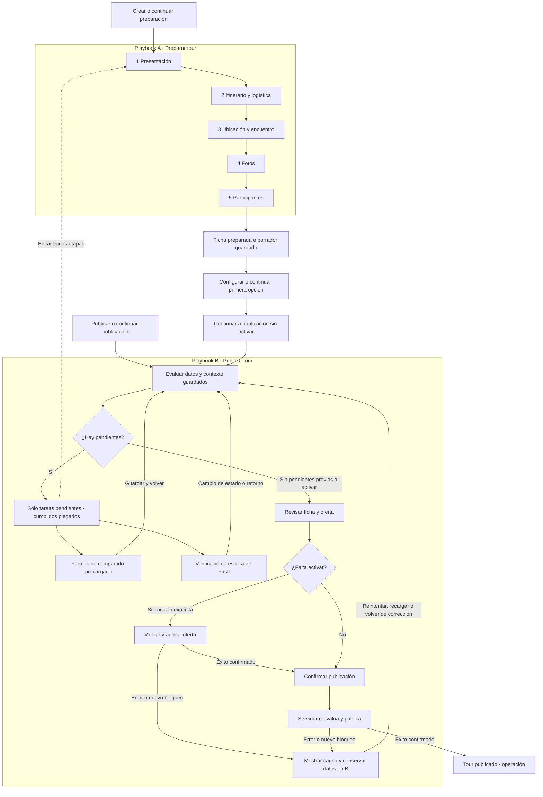

# Preparar y publicar un tour: dos playbooks, un flujo

Status: active  
Document type: canonical  
Owner: Tours / Provider Experience  
Last verified: 2026-10-09
Scope: contrato objetivo de experiencia, navegación y continuidad entre Preparar tour y Publicar tour  
Source of truth: requerimiento de separación del proveedor; diagnóstico en `src/lib/tours/tourDiagnosticContract.ts` y contrato compartido de playbooks de tours  
Related code/tests: `src/layouts/PlaybookLayout.astro`, `src/lib/playbook/launch-tour.ts`, `src/lib/playbook/complete-to-publish.ts`, `src/lib/tours/tourDiagnosticContract.ts`, `tests/playbook/`, `tests/render/tour-preparation-progress.test.ts`  
Review trigger: cambio de responsabilidades, navegación, validaciones o continuidad de los dos playbooks

Lector: diseño y agente implementador. Acción: implementar y evaluar la separación de los
playbooks sin duplicar datos ni formularios. Este contrato específico desarrolla el
[flujo principal de tours](./tour-provider-playbooks.md); el contrato general conserva
las reglas de diagnóstico, autorización, inventario y demás flujos.

## Especificación detallada para el agente

Este reporte se completa con dos contratos técnicos que deben aplicarse conjuntamente:

- [Interfaz y formularios](./tour-playbook-ui-contract.md): cambios por componente,
  referencia visual actual, tareas, guardado y publicación.
- [Navegación y verificación](./tour-playbook-navigation-contract.md): identidades,
  enlaces antiguos, sesiones, eficiencia, orden de ejecución y pruebas de cierre.

Las etiquetas y estilos actuales de «Ver etapas» se conservan. Los nombres abreviados
utilizados en el análisis y diagrama no prescriben cambios de apariencia ni de etiquetas.

## Reporte de reformulación y alcance

**Contrato vigente en el código local.** Sustituye la solución de dos fases que compartían
cabecera de etapas y comprobaciones. La validación local no acredita un despliegue operativo.

La crítica es de arquitectura de información: en una pantalla de edición se presentan
ubicación, nueve etapas, once comprobaciones, estados, contexto comercial y formulario.
El administrador debe interpretar dos modelos de avance antes de realizar su tarea.
Plegar ambas listas o mejorar sus colores no resuelve esa competencia.

La solución es **dos playbooks diferenciados dentro de un flujo continuo**:
**Preparar tour** construye el borrador; **Publicar tour** resuelve pendientes y confirma
su publicación. Cada uno tiene entrada, navegación, retorno y criterio de salida propios.
El tour, su opción y su tarifa son los mismos; no se copian datos entre partes.

## Por qué esta separación resuelve la crítica

La propuesta anterior distinguía nombres, pero seguía pidiendo al usuario leer dos índices
para completar un formulario. La nueva separación cambia la responsabilidad de cada pantalla:
en A se responde «¿qué estoy construyendo?»; en B, «¿qué impide publicarlo?».

No recomiendo dos asistentes que repitan formularios obligatorios: trasladarían la redundancia
de una pantalla al recorrido completo. Tampoco numeraciones 1-a/1-b: explican jerarquía, pero
mantienen el problema de interpretar etapas y requisitos simultáneos. Dos playbooks conectados
permiten crear de manera guiada y, después, resolver únicamente excepciones.

El coste real de esta solución está en conservar el origen y el retorno de cada formulario.
Debe asumirse en navegación y persistencia, sin trasladarlo al administrador mediante más
textos, selectores de modo o indicadores. «Preparar tour» y «Publicar tour» son nombres de
acciones reconocibles; la palabra playbook no necesita aparecer en la interfaz.

Participantes, opción, precio y condiciones tienen entradas propias. Cada etapa abre el
formulario que promete su título y evalúa sólo sus comprobaciones. El índice permanece
plegado; expandirlo no muestra instrucciones ni formularios adicionales.

## Playbook A — Preparar tour

**Gatillos:** Crear tour; Continuar preparación de un borrador que quedó en esta parte;
Editar preparación desde la segunda parte cuando el usuario quiera revisar varias etapas.

| Etapa                     | Formularios existentes                                                      |
| ------------------------- | --------------------------------------------------------------------------- |
| 1. Presentación           | Un único formulario: nombre, destino, descripción, destacados y categorías. |
| 2. Itinerario y logística | Duración, itinerario, inclusiones y requisitos.                             |
| 3. Ubicación y encuentro  | Punto de encuentro, dirección e indicaciones.                               |
| 4. Fotos                  | Carga, portada, orden y descripciones.                                      |
| 5. Participantes          | Tipos de participante y edades admitidas.                                   |


Presentación incluye nombre, destino, descripción, destacados y categorías tanto al crear como
al corregir desde Publicación. El resumen agrupa contenido y categorías en una sola tarea;
no muestra Presentación cumplida mientras alguna de sus comprobaciones esté pendiente.
Las entradas antiguas de contenido y categorías redirigen al formulario unificado conservando
selección y retorno. Las comprobaciones del servidor siguen validándose por separado.

Las cinco entradas del índice tienen destinos estables, independientes del primer requisito
pendiente. Fechas y cupos abre el calendario; si falta opción o tarifa, esa entrada explica la
dependencia y ofrece la acción correspondiente. No redirige silenciosamente a crear una opción.
Se puede trabajar fuera de orden cuando existan las entidades necesarias. Guardar continúa al
siguiente formulario lógico; una corrección de Publicación vuelve a su resumen. Al terminar
preparación, Publicación muestra los pendientes anteriores sin imponer otro recorrido completo.
Cambiar de etapa con cambios locales pide confirmación. Mientras se cargan fotos o se guarda,
se impide abandonar por un enlace; cerrar o recargar utiliza la advertencia del navegador.
Sólo la confirmación de persistencia elimina la advertencia del formulario correspondiente.

La etapa «Presenta tu experiencia» se completa en una sola página. El guardado conjunto de
nombre, destino, descripción, destacados y categorías es transaccional; «Guardar y pasar a
recorrido» conduce a la etapa 2. «Guardar y salir» permite conservar una presentación parcial
como borrador. Las antiguas entradas de descripción y categorías de preparación redirigen
a `/product/{id}/presentation`, con los datos existentes y el contexto conservados. La etapa
actual pendiente se presenta como «En curso»; navegar nunca acredita requisitos completados.

**Pantalla normal:** identidad breve del tour, `Paso 1 de 5`, título del formulario,
campos pertinentes y una acción principal. La etapa completa se consulta mediante
un único acceso «Ver etapas», cerrado por defecto; no se imprime su lista junto al formulario.
No hay comprobaciones, porcentaje de preparación, cuatro paneles de diagnóstico ni avisos
repetidos de publicación. Se preservan estilos, tarjetas, tipografía y resaltados existentes.

La etapa indica ubicación en el recorrido. No se añade «Pendiente · Etapa actual» a cada
pantalla ni se considera completa una etapa por visitarla. La quinta etapa contiene sólo Participantes. Perfil de opción, precio, condiciones y fechas pertenecen al asistente independiente de opciones, no a la ficha del tour.

**Persistencia:** Guardar y continuar valida el formulario y confirma el guardado antes de
avanzar. Los errores son locales y conservan datos. Puede guardarse un borrador parcial cuando
el contrato de datos lo permita; no se inventan valores para saltar campos obligatorios.
Una omisión permitida se ofrece como «Completar después», sin marcarla cumplida.
«Guardar y salir» exige guardado real; un borrador local se identifica como tal.

**Salida de la ficha:** guardar Participantes abre `/product/{id}/preparation-complete`.
La pantalla no contiene índice ni porcentaje comercial. Con contenido incompleto dice
«Tu borrador está guardado» y ofrece los formularios pendientes; sólo con las cinco áreas
comprobadas dice «La ficha de tu tour está preparada». Un fallo de lectura permite reintentar.

**Primera opción:** la acción POST inicia o recupera una sesión `first_publication` por
proveedor, usuario y producto. Con varias ofertas exige selección explícita; con una oferta
válida conserva sus identificadores. No crea sesiones mediante GET. La cabecera dice
«Configurar primera opción»; las entradas ordinarias siguen diciendo «Añadir opción» o
«Añadir horario». Ambos usan los mismos cinco formularios comerciales.

En revisión de la primera opción, «Continuar a publicación» persiste `handoffAt` y conserva
opción/tarifa sin activar ni publicar. Puede consultarse publicación con pendientes de Fastt.
La sesión sigue activa: transferir navegación no acredita activación. Al reanudar vuelve a
publicación; editar una etapa elimina esa marca y recupera el asistente. Añadir una opción o
horario a un tour publicado conserva su salida a gestión y activación independiente.

## Playbook B — Publicar tour

**Gatillos:** Continuar a publicación desde A; Publicar desde la ficha o catálogo;
Continuar publicación cuando se salió de B. Un borrador existente puede entrar directamente:
B evalúa datos, no exige haber visitado A.

1. **Evaluar lo guardado.** Resolver el tour y la oferta seleccionada; cargar diagnóstico vigente.
2. **Mostrar sólo trabajo pendiente.** Una lista breve de tareas accionables con causa concreta.
   Los requisitos cumplidos se reconocen automáticamente y quedan bajo «Requisitos cumplidos (N)».
3. **Resolver una tarea.** Abrir el formulario compartido precargado, enfocado en el dato faltante.
   Guardar → reevaluar → volver al resumen de publicación. No enviar al siguiente paso de A.
4. **Resolver habilitación aplicable.** Reutilizar verificación con retorno a B. Si corresponde
   actuar a Fastt, mostrar «En revisión por Fastt»; no pedir al proveedor corregir algo ajeno.
5. **Revisar y confirmar.** Mostrar la ficha del viajero y la oferta elegida cuando proceda.
   Activar la oferta mediante acción explícita si falta; después permitir Publicar tour.
   Cada comando vuelve a validar en servidor. Un éxito de activación se conserva si publicar falla.
6. **Confirmar resultado.** Mostrar publicación persistida y acceso a operación. Una reserva
   compartida necesita cupo vigente; una solicitud privada no equivale a reserva ni retiene cupo.

**Pantalla normal de B:** título Publicar tour, contexto compacto, pendientes y una acción
principal contextual. No incluye las cinco etapas, «Etapa 3 de 5» ni una lista duplicada por etapas.
No sustituirlo por otro wizard de diez pantallas obligatorias: se trabaja sólo lo que falta.

Puede mostrarse «3 tareas pendientes»; no «Requisito 1 de 10». La unidad es una tarea accionable:
perfil y capacidad, por ejemplo, pueden resolverse juntos en el mismo formulario. No confundir
ese número variable con el inventario técnico de diez validaciones. Los pendientes de Fastt
se distinguen de las acciones del proveedor; los cumplidos no ocupan el área principal.

Si todo está cumplido, B abre directamente la revisión final. Si falta autorización, permite
resolver otros pendientes mientras se espera. Un error de lectura muestra Reintentar y conserva
la selección; nunca convierte los datos desconocidos en formularios supuestamente vacíos.

## Formularios compartidos: un dato, dos contextos

| Caso                                 | Comportamiento de B                                             |
| ------------------------------------ | --------------------------------------------------------------- |
| Dato válido guardado en A            | Cumplido automáticamente; no volver a solicitarlo.              |
| Formulario parcialmente guardado     | Precargar valores; señalar sólo lo que falta o es inválido.     |
| Dos requisitos usan un formulario    | Una tarea y un guardado; reevaluar ambos requisitos.            |
| Usuario revisa un requisito cumplido | Mostrar resumen; Editar abre los valores actuales.              |
| Cambio invalida otro requisito       | Actualizar afectados y explicar la causa, sin borrar datos.     |
| Nueva opción o tarifa seleccionada   | Reevaluar ese contexto; no heredar cumplimiento de otra oferta. |

«Llenado» no significa «cumplido»: una foto cargada no satisface un mínimo de cinco; una
condición seleccionada puede ser incompatible. El dato se conserva y se explica el pendiente.
Los mínimos vigentes (cinco fotos, tres actividades del itinerario) se comunican junto al campo.
No se inventan requisitos de publicación para justificar la existencia de B.

**Correspondencia de las diez validaciones:** presentación y actividades ← etapa 1;
logística ← etapa 2; fotos ← etapa 3; participantes, perfil, capacidad, precio y condiciones
← etapa 4; calendario configurado ← etapa 5. Autorización, activación y disponibilidad
conservan sus reglas independientes; no se suman artificialmente a esas diez validaciones.

## Ejemplo: editar una salida

```text
PREPARAR TOUR                         PUBLICAR TOUR
Paso 1 de 5                         Completar opción
Prueba de certificación · 09:00       Prueba de certificación · 09:00
Configura tu opción                  Falta indicar el máximo del grupo.
[Formulario con datos actuales]      [Mismo formulario, datos precargados]
Guardar y continuar                  Guardar y volver
```

En ambos casos se presenta un solo formulario. Datos secundarios y ayudas extensas aparecen
cuando son pertinentes. No se eliminan campos operativos necesarios: se elimina la navegación
y el diagnóstico repetidos que precedían al formulario. La explicación sobre cupos existentes
se muestra junto al cambio de capacidad, no como introducción de todas las pantallas.

## Flujo completo y retornos



El regreso explícito de B a A conserva un retorno a B; una corrección puntual permanece en B.
Salir y reanudar mantiene **qué playbook**, pantalla, tour, opción, tarifa y retorno.
Cambiar de parte no reinicia datos, no crea otra oferta y no significa publicar.
El diagrama Mermaid anterior es la referencia del flujo actual; el mapa editable anterior conserva el recorrido histórico y no redefine las cinco etapas.

Correspondencia con el código local: el calendario usa «Continuar a publicación».
Los errores de activación y publicación muestran la causa en B y conservan lo guardado;
no redirigen automáticamente al evaluador. Reintentar vuelve a validar en servidor,
y recargar o volver de una corrección actualiza el diagnóstico. La activación exitosa
recarga B antes de confirmar la publicación. Esta precisión no cambia las reglas de negocio.

## Evaluación de la solución y criterios de aceptación

La separación es adecuada si elimina la doble navegación y evita repetir trabajo. Fracasa
si sólo cambia títulos, si B empieza con diez formularios vacíos o si reaparecen etapas en B.

- A sólo muestra su etapa y formulario; B sólo sus pendientes y resolución.
- Un requisito válido de A aparece cumplido al entrar en B, sin confirmación manual.
- Con precio válido y fotos insuficientes, B solicita fotos; no fuerza a recorrer precio.
- Perfil y capacidad pendientes abren una sola edición precargada y retornan a B.
- Con todo preparado, autorización pendiente no reinicia A ni reduce su avance.
- Una revisión de Fastt no genera una tarea documental ficticia para el proveedor.
- Recargar, salir, volver o cambiar de dispositivo conserva contexto persistido válido.
- Fallos, doble envío y respuesta perdida no duplican opciones ni borran avances.
- Guardar perfil no cambia fechas/reservas; agotamiento no se interpreta como preparación vacía.
- Se preservan estilos anteriores; móvil, teclado y foco no exponen dos índices simultáneos.
- Publicar reevalúa permisos; un porcentaje o una pantalla visitada nunca concede capacidad.

La resolución del **contexto del playbook** en `tour-playbook-context.ts` se separa de la
definición de los formularios. `PlaybookLayout.astro` monta etapas únicamente en A y contexto
de corrección en B. `launch-tour.ts`, `complete-to-publish.ts`, sesiones, catálogo y enlaces
de corrección distinguen A/B y sus retornos. Mantener los evaluadores,
repositorios y comandos compartidos; no duplicar validadores ni guardar copias del formulario.
Los IDs heredados requieren compatibilidad: `complete-to-publish` sin versión también reanuda A;
no basta renombrarlo para enviar todas sus URLs a B. Migrar intención y sesiones explícitamente,
sin inventar una tabla nueva antes de comprobar las capacidades de la persistencia existente.

## Gestión después de crear la ficha

Mis tours conserva nombre, imagen y estado editorial. La acción principal utiliza el
mismo diagnóstico que la ficha administrativa: continuar contenido pendiente, retomar
la primera configuración, resolver una verificación o revisar publicación. Una tarea
que depende de Fastt conserva su acción de consulta; no invita a aportar documentos
sin un requisito aplicable. Las sesiones de configuración se consultan por página,
con propiedad de proveedor y usuario; su lectura no crea sesiones.

Cada tarjeta mantiene «Opciones y horarios» y un menú breve con Editar ficha,
Vista previa y Revisar publicación cuando no repita la acción principal. Precio y
calendario se gestionan dentro de la opción; los accesos globales operativos permanecen.

La ficha administrativa separa Ficha del tour, Opciones y horarios y Publicación.
Participantes pertenece al contenido; categorías se edita dentro de Presentación.
No conserva un bloque adicional de Operación que repita estas herramientas.

Vista previa abre la presentación al viajero en modo proveedor, conservando opción
y tarifa validadas. Revisar publicación abre el diagnóstico y la confirmación expresa.
Una corrección guiada regresa a publicación; una edición desde la ficha regresa al
mismo tour, conservando su selección. El retorno editorial sólo acepta la página de
ese producto; no admite destinos externos ni otro tour. Fotos conserva la revisión
por archivo antes de abandonar la pantalla.
